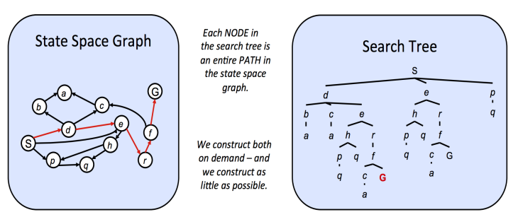

# Intro to AI

## Chapter 1 Introduction & AI agent

In Artificial Intelligence, the central problem at hand is that of the creation of a rational agent. "rational" means that maximally achieving **predefined goals(Rutgers)/expected utility(Berkeley)**.
And the "agent" could be a human, a robot, a software, etc, it can choose its actions based on only its previous actions and observations.

A reflex agent is one that does not think about the consequences of its actions, but rather selects an action based on the current state of the world. These agents are typically outperformed by planning agents, which make decisions based on (hypothesized) consequences of actions and have a model of how the world evolves in response to actions. A replanning agent is similar to a planning agent but can adapt its plan when the environment changes or when new information becomes available.

## Chapter 2 Search

### State Spaces and Search Problems
In order to create a rational planning agent, we need a way to mathematically express the given environment in which the agent will exist. To do this, we must formally express a search problem - given our agent’s current state (its configuration within its environment), how can we arrive at a new state that satisfies its goals in the best possible way? A search problem consists of the following elements:
-  A state space: The set of all possible states that are possible in your given world.
-  A set of actions available in each state.
-  A transition model: Outputs the next state when a specific action is taken at current state.
-  An action cost: Incurred when moving from one state to another after applying an action.
-  A start state: The state in which an agent exists initially.
-  A goal test: A function that takes a state as input, and determines whether it is a goal state.

The difference between a **world state** and a **search state** is that a world state contains all information about a given state, whereas a search state contains only the information about the world that is necessary for planning.

### State Space Size
Estimating the computational runtime of solving a search problem is the size of the state space.

### State Space Graphs and Search Trees
A state space graph is constructed with states representing nodes, with directed edges existing from a state to its children. These edges represent actions, and any associated weights represent the cost of performing the corresponding action.

Unlike state space graphs, search trees have no such restriction on the number of times a state can appear. Search trees are also a class of graph with states as nodes and actions as edges between states, each state/node encodes not just the state itself, but the entire path (or plan) from the start state to the given state in the state space graph.

### Uninformed Search
Uninformed search is like trying to find your way through a maze without a map. Here's how it works:
1. Starting point: You begin at the entrance of the maze. This is your "start state."
2. Making a plan: As you explore, you keep a list of possible paths to try. This list is called the "frontier."
3. Exploring: You pick a path from your list and follow it a bit further into the maze.
4. New choices: When you reach a point where the path branches, you add these new options to your list of paths to try later.
5. Keeping track: For each new path you discover, you remember:
   - Where it leads
   - How you got there
   - How far you've traveled
6. Repeat: You keep doing this - picking a path, exploring it, and adding new options to your list.
7. Finding the exit: You continue this process until you pick a path that leads to the exit (your "goal state").
8. Success!: Once you find the exit, you can trace back the path you took to get there.

The key thing about uninformed search is that you don't have any special knowledge about which paths might be better. You're just systematically trying different options until you find the goal.

When we have no knowledge of the location of goal states in our search tree, we are forced to select our strategy for tree search from one of the techniques that falls under the umbrella of uninformed search. We’ll now cover three such strategies in succession: **depth-first search**, **breadth-first search**, and **uniform cost search**.

#### Depth-First Search
Depth-first search (DFS) is a strategy for exploration that always selects the *deepst* frontier node from the start node for expansion. 
Removing the deepest node and replacing it on the frontier with its children necessarily means the children are now the new deepest nodes - their depth is one greater than the depth of the previous deepest node.This implies that to implement DFS, we require a structure that always gives the most recently added objects highest priority.
DFS is not complete. If there exist cycles in the state space graph, this inevitably means that the corresponding search tree will be infinite in depth.
DFS simply finds the "leftmost" solution in the search tree without regard for path costs, and so is not optimal.
#### Breadth-First Search
Breadth-first search (BFS) is a strategy for exploration that always selects the *shallowest* frontier node from the start node for expansion.
If we want to visit shallower nodes before deeper nodes, we must visit nodes in their order of insertion. 
If a solution exists, then the depth of the shallowest node $s$ must be finite, so BFS must eventually search this depth. Hence, it’s complete.
BFS is generally not optimal because it simply does not take costs into consideration when determining which node to replace on the frontier.
#### (Rutgers)Bidirectional Search
Bidirectional Search is running two simultaneous BFS: one forward from the initial state, and one backward from the goal. They stop when the two meet in the middle.
#### Uniform Cost Search
Uniform cost search (UCS), is a strategy for exploration that always selects the lowest cost frontier node from the start node for expansion.
To represent the frontier for UCS, the choice is usually a heap-based priority
queue, where the priority for a given enqueued node $v$ is the path cost from the start node to $v$, or the backward cost of $v$.
UCS is complete. If a goal state exists, it must have some finite length shortest path.
UCS is also optimal if we assume all edge costs are nonnegative. 

## Chapter 3 Informed Search

